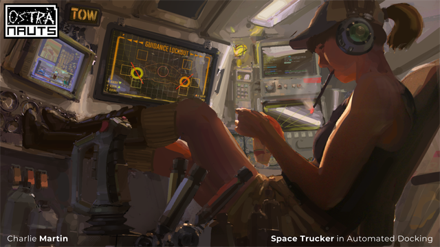
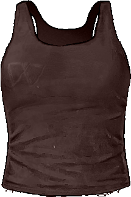
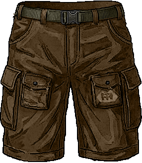
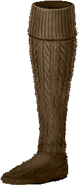
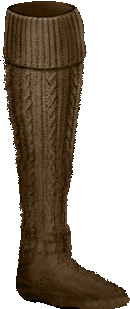

# Space Trucker Clothing Mod v1.11
**Clothing Assets that mimic the concept art [Space Trucker by Charlie Martin](https://ostranauts.wiki.gg/index.php?curid=4382").**


[](https://download-directory.github.io/?url=https://github.com/Kor-ok/NeonDistraction_Ostranauts/tree/main/Mods/SpaceTrucker)


> [!WARNING]
> Known Issues:
>+ Boots/Socks layering can get pushed around via other mods
>   + *Will look into solutions*
>+ IsBarefoot still remains after wearing the boots
>   + *Not yet certain why but I did see related base game issues*
>+ Lanyard appearance currently does not change with Permit
>   + *Will look into solutions*
>+ Crew2 Body Slots overwritten.
>   + *Will cause issues when the game updates this entry*

## Spawn All Items

```text
spawn AllSpaceTruckerItems
```
```text
spawn AllSpaceTruckerLanyards
```
> [!NOTE]
> Stats are subject to change

| NASA E-Ink PDA ||
|-|-|
| <div align="center"></div> | <ul><li>PLACEHOLDER</li></ul> |
|| `spawn ItmSpaceTruckerEinkPDANewPlayer`
|
| Ayotimiwa Headphones ||
|-|-|
| <div align="center"></div> | <ul><li>+StatPiloting = 1.0x0.4</li><li>-StatDefense = 1.0x0.06</li><li>-StatThreat = 1.0x3</li></ul> |
|| `spawn ItmSpaceTruckerHeadphonesAyotimiwa_S01_B00_C01` |
| Breakout Cap: Ganymede Warriors ||
| <div align="center"></div> | <ul><li>+StatBodyInsulation = 1.0x0.1</li><li>+IsFanBreakoutWarriors = Not yet implemented</li></ul> |
|| `spawn ItmSpaceTruckerHatWarriors_S01_B00_C01` |
| Camisole (Size Small) ||
| <div align="center"></div> | <ul><li>No Special Effects</li></ul> |
|| `spawn ItmSpaceTruckerCamisoleWeber_S01_B02_C01` |
| Tanktop (Size Large) ||
| <div align="center"></div> | <ul><li>No Special Effects</li></ul> |
|| `spawn ItmSpaceTruckerCamisoleWeber_S01_B01_C01` |
| Cargo Shorts (Size Small) ||
| <div align="center"></div> | <ul><li>+StatBodyInsulation = 1.0x0.1</li><li>+StatSafeTempMax = 1.0x2</li><li>+StatSafeTempMin = 1.0x3</li><li>+IsWearingPants = 1.0x1</li><li>+StatSleepComfort = 1.0x0.1</li><li>+StatHygieneRate = 1.0x0.1</li><li>-StatFatigueCoeff = 1.0x0.1</li><li>-StatEncumbrance = 1.0x0.1</li></ul> |
|| `spawn ItmSpaceTruckerShortsHughes_S01_B02_C01` |
| Cargo Shorts (Size Large) ||
| <div align="center"></div> | <ul><li>Same as above</li></ul> |
|| `spawn ItmSpaceTruckerShortsHughes_S01_B01_C01` |
| Compression Socks ||
| <div align="center"></div> | <ul><li>+StatBodyInsulation = 1.0x0.2</li><li>-StatSafeTempMax = 1.0x2</li><li>-StatSafeTempMin = 1.0x3</li><li>-StatHygieneRate = 1.0x0.1</li><li>-IsBarefoot = 1.0x1</li><li>⏎ IsWearingCompressionSocks = 0.5x1</li><ul><li>+ThreshStatGrav = 1.0x0.03125</li><li>+StatBloodHealRate = 1.0x0.0011</li><li>+StatWoundHealRate = 1.0x0.00125</li><li>+StatInfectionHealRate = 1.0x0.000125</li><li>-StatFatigueCoeff = 1.0x0.125</li><li>+ThreshStatEncumbrance = 1.0x0.03125</li><li>-StatFoodRate = 1.0x0.0375</li><li>-StatHydrationRate = 1.0x0.0375</li></ul></ul> |
|| `spawn ItmSpaceTruckerSocksCompression` |
| Black Wing "Carbide Capped" Boots ||
| <div align="center"></div> | <ul><li>+StatBodyInsulation = 1.0x0.2</li><li>+StatThreat = 1.0x6</li><li>-IsBarefoot = 1.0x1</li><li>-StatSafeTempMin = 1.0x0.5</li><li>+StatMovSpeedPenalty = 1.0x0.05</li><li>+ThreshStatGrav = 1.0x0.1</li><li>-ThreshStatEncumbrance=1.0x0.1</li><li>+ThreshStatSecurity = 1.0x0.2</li><li>+ThreshStatEsteem = 1.0x0.3</li></ul> |
|| `spawn ItmSpaceTruckerBootKompart` |
